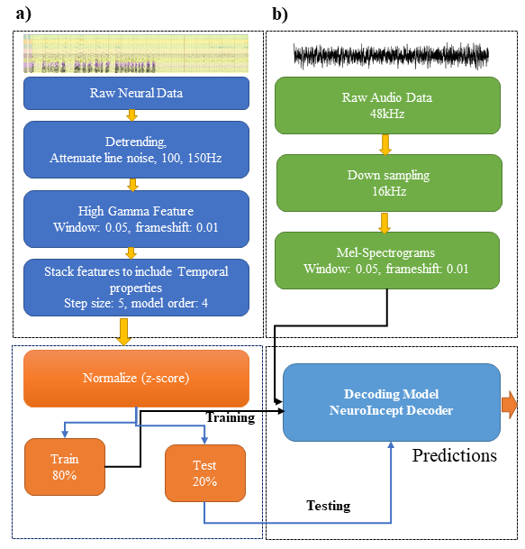
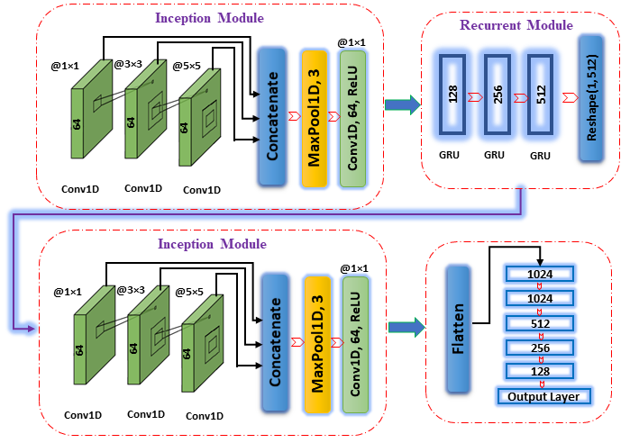

# Audio Processing and Reconstruction Project

This project focuses on processing, reconstructing, and visualizing audio data. It is designed to work with datasets that involve audio recordings from multiple participants, performing tasks such as feature extraction, audio reconstruction, and generating visualizations to assess performance.

## Project Structure

- **Feature Extraction**: Extracts important features from the audio recordings of multiple participants.
- **Audio Reconstruction**: Recreates audio signals from the extracted features using the custom `AudioReconstructor` class.
- **Visualization**: Generates plots to visualize correlations, STGI (Short-Time Geometric Image) results, and model training history.

## Preprocessing Pipeline

Below is an illustration of the preprocessing pipeline used in the project:



## Model Architecture

The custom model architecture used for audio reconstruction is shown below:



## Configuration

The project is configured using the `config` file located in `src/config.py`. The key parameters include:

- **num_jobs**: Number of parallel jobs for processing (default: 20)
- **extract_features**: Whether to run feature extraction (`True` or `False`)
- **construct**: Whether to run the audio reconstruction process (`True` or `False`)
- **visualization**: Whether to generate visualizations (`True` or `False`)
- **current_dir**: The current working directory.
- **dataset_dir**: Directory containing the dataset (`SingleWordProductionDutch-iBIDS`).
- **features_dir**: Directory where extracted features are stored.
- **results_dir**: Directory where the results (e.g., reconstructions, plots) will be saved.
- **no_of_mel_spectrograms**: The number of mel spectral Bins (default: 128).
- **epochs**: Number of epochs for model training (default: 100).
- **batch_size**: Batch size for model training (default: 128).
- **num_folds**: Number of folds for cross-validation (default: 10).

## How to Run

1. **Install Dependencies**: Make sure to install the required Python libraries before running the project. You can install them using:
    ```bash
    pip install -r requirements.txt
    ```

2. **Configure the Project**: Modify the settings in `src/config.py` to fit your requirements. For example, set `extract_features`, `construct`, or `visualization` to `True` depending on the tasks you want to perform.

3. **Run the Script**:
    - To run the feature extraction, reconstruction, and visualization:
    ```bash
    python main.py
    ```

## Visualization

If `visualization` is set to `True` in the configuration file, the project will generate the following plots:

- **Correlation Plot**: Shows the correlation between different extracted features.
- **STGI Plot**: Displays the results of the Short-Time Geometric Image calculations.
- **History Plot**: Tracks the history of the model's training process, showing loss, accuracy, or other metrics.
- **Spectrograms Plot**: Spectrograms generated by various model architectures.

## Dataset

The project uses a dataset called `SingleWordProductionDutch-iBIDS`, which should be placed in the directory specified in `config.py` under `dataset_dir`.

## Packages Used

This project uses the following key Python packages:

- `numpy`: For numerical operations and array manipulation.
- `scipy`: For signal processing and scientific computations.
- `librosa`: For audio processing and feature extraction.
- `matplotlib`: For generating plots and visualizations.
- `tensorflow`: For model building, training, and evaluation.
- `scikit-learn`: For statistical modeling and cross-validation.
- `pandas`: For data manipulation and analysis.
- `joblib`: For parallel processing.
- `seaborn`: For enhanced visualizations and plotting.

